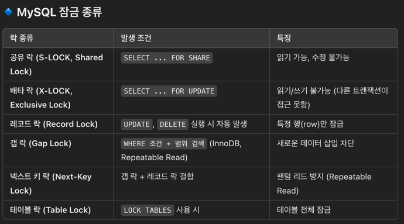
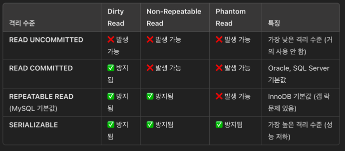

# RealMySQL 책 참고

### 3/18

# 아키텍처
- 이후 내용 보강 필요 필요한 내용만을 찾아 학습한 상태 

### 스레드
- MySQL 서버는 프로세스 기반이 아닌 스레드 기반으로 작동하며 크게 백그라운드, 포그라운드 스레드들로 구분됨
- `포그라운드 스레드` 는 DB 서버에 접속한 최소한 클라이언트 수 이상으로 존재하고 요청 쿼리를 처리한다
- `백그라운드 스레드` 는 실질적으로 데이터를 쓰고 읽고 로그릴 기록하는 작업을 한다
- 위 와 같이 스레드가 나눠져 있기 때문에 쓰기작업(Insert, Update, Delete) 와중에도 사용자는 새로운 작업을 수행할 수 있다

### MVCC(Multi-Version Concurrency Control)
- 잠금을 사용하지 않는 일관된 읽기를 제공하는 것에 목적을 둔다
- 여러 버전(스냅샷) 을 유지하면서 트랜잭션 처리 -> 실제로는 언두 로그에 쓴다는 것이 더욱 정확
- 트랜잭션이 실행될때 변경된 데이터를 보지않고 트랜잭션이 시작되었을 당시의 데이터(스냅샷)을 조회
- 오래된 데이터 버전이 많아지면 스토리지 사용량 증가됨

# 트렌젝션 과 락

###  트랜 제션 구간 최소화의 필요성
  - 트렌젝션 동안 락이 걸리기에 얼마나 걸릴지 알 수 없는 코드 특히 네트워크 코드는 반드시 제외되어야한다
  - 커넥션 및 트랜잭션 상황을 최대한 미룰수록 커넥션 풀의 낭비를 줄일 수 있다
  - MVCC 에 의해서 트레젝션이 지속된다면 언두 로그를 지울 수 없기 메모리 낭비가 일어난다

### 락의 종류
- 이 이외에도 여러 락이 있지만 주요 락으로 레코드, 넥스트 키락을 기억하자
- 넥스트 키 락은 특정 범위 까지 잠그게 되고 이로 인해 팬텀 리드를 방지할 수 있다 
  - InnoDB 스토리지 엔진에는 넥스트키 락 덕분에 REPEATABLE READ 수준에서도 팬텀 리드 발생X 

### 인덱스와 잠금 (170p)
- 기본적으로 인덱스 기반 락이 적용됨(레코드 기반이 아님)
- 변경해야할 레코드를 찾기 위해 검색한 인덱스의 레코드를 모두 락으로 걸어야함
- ex) 주소 & 이름 조건으로 찾더라도 주소만 인덱스 되어있다면 이 모두가 락 걸림 

### 격리수준
- 한 트렌젝션이 다른 트렌젝션에게 어느 정도의 배타성을 가지는지를 나타냄
- 격리 수준 별 발생 가능 문제 정리
  - DirtyRead 는 다른 세션에서의 커밋되지 않은 상태를 공유하게 된다
  - Non-Repeatable Read 는 한 트렌젝션 중간에 다른 세션에서 업데이트 커밋이 완료 된 경우 똑같이 조회하더라도 다른 값을 얻게되는 것을 말한다
    - ex) 오늘 입금됨 총액을 조회하는 상황에서 입/출금이 계속될 경우 총 합 계산은 조회 할때마다 달라진다
  - PhantomRead 는 한 트랜잭션 내에서 일반 SELECT 와 SELECT ... FOR UPDATE 결과가 다르게 나오는 문제.

