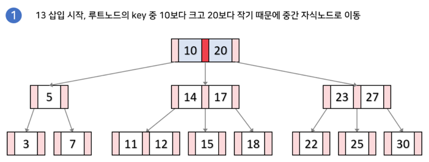

# RealMySQL 책 참고

### 3/18

# 아키텍처
- 이후 내용 보강 필요 필요한 내용만을 찾아 학습한 상태 

### 스레드
- MySQL 서버는 프로세스 기반이 아닌 스레드 기반으로 작동하며 크게 백그라운드, 포그라운드 스레드들로 구분됨
- `포그라운드 스레드` 는 DB 서버에 접속한 최소한 클라이언트 수 이상으로 존재하고 요청 쿼리를 처리한다
- `백그라운드 스레드` 는 실질적으로 데이터를 쓰고 읽고 로그릴 기록하는 작업을 한다
- 위 와 같이 스레드가 나눠져 있기 때문에 쓰기작업(Insert, Update, Delete) 와중에도 사용자는 새로운 작업을 수행할 수 있다

### MVCC(Multi-Version Concurrency Control)
- 잠금을 사용하지 않는 일관된 읽기를 제공하는 것에 목적을 둔다
- 여러 버전(스냅샷) 을 유지하면서 트랜잭션 처리 -> 실제로는 언두 로그에 쓴다는 것이 더욱 정확
- 트랜잭션이 실행될때 변경된 데이터를 보지않고 트랜잭션이 시작되었을 당시의 데이터(스냅샷)을 조회
- 오래된 데이터 버전이 많아지면 스토리지 사용량 증가됨

# 트렌젝션 과 락

###  트랜 제션 구간 최소화의 필요성
  - 트렌젝션 동안 락이 걸리기에 얼마나 걸릴지 알 수 없는 코드 특히 네트워크 코드는 반드시 제외되어야한다
  - 커넥션 및 트랜잭션 상황을 최대한 미룰수록 커넥션 풀의 낭비를 줄일 수 있다
  - MVCC 에 의해서 트레젝션이 지속된다면 언두 로그를 지울 수 없기 메모리 낭비가 일어난다

### 락의 종류
- 이 이외에도 여러 락이 있지만 주요 락으로 레코드, 넥스트 키락을 기억하자
- 넥스트 키 락은 특정 범위 까지 잠그게 되고 이로 인해 팬텀 리드를 방지할 수 있다 
  - InnoDB 스토리지 엔진에는 넥스트키 락 덕분에 REPEATABLE READ 수준에서도 팬텀 리드 발생X 

### 인덱스와 잠금 (170p)
- 기본적으로 인덱스 기반 락이 적용됨(레코드 기반이 아님)
- 변경해야할 레코드를 찾기 위해 검색한 인덱스의 레코드를 모두 락으로 걸어야함
- ex) 주소 & 이름 조건으로 찾더라도 주소만 인덱스 되어있다면 이 모두가 락 걸림 

### 격리수준
- 한 트렌젝션이 다른 트렌젝션에게 어느 정도의 배타성을 가지는지를 나타냄
- 격리 수준 별 발생 가능 문제 정리
  - DirtyRead 는 다른 세션에서의 커밋되지 않은 상태를 공유하게 된다
  - Non-Repeatable Read 는 한 트렌젝션 중간에 다른 세션에서 업데이트 커밋이 완료 된 경우 똑같이 조회하더라도 다른 값을 얻게되는 것을 말한다
    - ex) 오늘 입금됨 총액을 조회하는 상황에서 입/출금이 계속될 경우 총 합 계산은 조회 할때마다 달라진다
  - PhantomRead 는 한 트랜잭션 내에서 일반 SELECT 와 SELECT ... FOR UPDATE 결과가 다르게 나오는 문제.

### 3/19

### 순차 I/O
- 연속된 블록에 저장되어 있고 이를 순차적으로 읽거나 쓰는 방식
- 일반적으로 큰 파일을 저장하거나 스트링밍할때 또는 전체 테이블을 조회할때 쓰이는 방식
- 오버헤드가 적고 속도가 빠름

### 랜덤 I/O
- 데이터가 비연속적인 위치제 저장되거 있으며 특정 데이터 블록을 임의로 접근하여 읽거나 쓰는방식
- 작은 블록 크기의 접근이 많음: 일반적으로 4KB 블록 크기를 사용함

### 순차 I/O vs 랜덤 I/O
- 같은 용량을 읽더라도 순차 I/O 특성상 연속된 큰 덩이리의 데이터로써 더 적은 횟수만 읽어도 되는 반면 랜점 I/O 의 경우 많이 읽어야 함
- 순차 big chunk -> 100kb * 4 / 랜덤 small chunk -> 4kb(최소단위) * 100

### 3/20
# 인덱스

### B-tree
- 구성
  - 노드는 최대 M개의 자식 노드를 가질 수 있다
    - ex) 3차 노드 기준으로 최대 3개 까지의 하향 화살표를 볼 수 있다 
  - 노드에는 최대 M-1개의 KEY 를 가질 수있다,
    - ex) 3차 노드 기준 노드안에 최대 2개까지의 요소가 존재함
- 인덱스 키 삽입
  - 들어갈 수 있는 적절한 위치를 찾고 해당자리의 key 개수가 한계치를 넘는다면 구조가 변경 됨
    - 최대 개수를 초가한 노드에서 중간 값을 상위 노드로 올린다 -> 이때 상위노드도 최대 값을 초과한다면 초과하지 않을때까지 올려 나간다
  - 삽입되어구조 변경되는 과정 참고(https://velog.io/@chanyoung1998/B%ED%8A%B8%EB%A6%AC)
- 인덱스 키 삭제
  - 리프 노드를 찾아서 그냥 삭제 마크만 함 -> 방치되거나 추후 재활용 됨
- 인덱스 키 변경
  - 키를 먼저 삭제한 후에 새로운 키값을 추가하는 형태
- 검색
  - 기본적으로 빠른 검색을 위해서 수정,삭제,추가의 효율을 희생하는 구조 
  - 수정,삭제 을 위해서는 검색이 선행되야함 
  - 검색을 포함한 수정,삭제, 추가 log(n) 복잡도를 가짐

### 인덱스 키 값의 크기
- 키값이 커질 수록 여러 페이지로 구성될 확률이 크고 그만큼 디스크로 부터 읽는 횟수가 늘기 때문에 성능이 떨어진다
- 또한 DB 엔진에서 한번에 캐시할 수 있는 크기도 제한적이기에 메모리 효율도 떨어진다

### 선택도(기수성)
- 인덱스는 선택도가 높을수록(중복율이 낮을 수록) 검색 대상이 줄기 때문에 그만큼 빠름
- 지나치게 중복이 심하다면 인덱스 생성을 고려해봐야한다

### 인덱스 효율
- 인덱스를 통해 레코드 1건을 읽는 것은 직접 읽기보다 4~5배 정도의 비용이 더 드는 것으로 예측됨
- 인덱스를 통해 읽어야할 레코드의 건수가 전체 테이블 레코드의 20~25% 를 넘으면 옵티마이저는 직접 읽을 수도 있음

### 커버링 인덱스
- 인덱스 자체만으로 필요 데이터를 모두 포함해서 테이블 조회가 추가로 필요하자 않는 경우
  - 예시
    - create INDEX idx_name_email on (name,email)
    - select name,email form users where name = 'john' 

### 스캔방식
- 레인지 스캔
  - 검색해야할 인덱스 범위가 결정됐을 때 사용하는 방식 
  - select * from user where name between 'eba' and 'gad'
  - 시작할 위치를 찾고 그때부터 순서대로 읽는 시스템
  - 해당 범위 인덱스 각각에 대해서 레코드 주소를 참조하여 레코드에 접근함, 이때 한건당 랜덤 I/O 가 한번씩 일어남
    - 그렇기에 인덱스를 통해 읽을 내용이 20~25 이내야 효율이 더 좋음

- 인덱스 풀 스캔
  - 인덱스 전체를 검색하는 것으로 커버링 인덱스, group by 등의 케이스에서 활용 될 수 있음
  - 이때도 테이블 전체 크기보다 인덱스가 크기가 훨씬 작을 경우 유리함
    - 기본적으로 인덱스는 더 적은 col 을 갖기에 페이지 크기가 더 적고 그만큼 디스크 I/O가 적음

- 루스 인덱스 스캔
  - SELECT dept_no, MIN(emp_no) form dept_emp WHERE dept_no BETWEEN 'd002' and 'd004' GROUP BY dept_no;

- 인덱스 스킵 스캔
  - 다중 컬럼 인덱스에 대해서 첫째 요소에 대한 조건이 아니더라도 인덱스 검색을 가능케 해줌
  - 옵티마이저가 내부적으로 첫째 조건의 유니크 값을 풀스캔하여 쿼리에 추가해주는 형식 -> 물론 더 효과적일때

### 다중 컬럼 인덱스
- 실제 인덱스는 2갱 이상의 컬럼을 보유하는 경우가 많다
- 인덱스는 자신보다 앞의 열에 의존적으로 정렬되기때문에 그 순서가 매우 중요하다

ALTER TABLE / GROUP BY