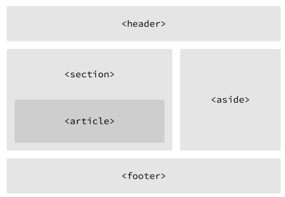

# 학습정리 원칙

1. 공부 내용은 기본적으로 깃헙(TIL)에 정리한다
2. 공유할 만한 내용은 정리하여 블로그에 게시한다
3. 사내 코드가 포함되는 내용은 Notion 에 작성하고 링크를 깃헙에 첨부한

--- 

# 정리& 학습 필요 주제

1. ErrorBoundary 에 대해서 throw 가 아닌 showErrorBoundary 로 처리하는 것이 옳다
2. 프로토 타입 학습

--- 
### [2/12]

### Promise
- Promise 개념에 있어 크게 Promise 객체를 반환하는 Producer 와 이를 사용하는 Executor 가 있다
- Producer 는 성공시 실행할 resolve 콜백과 실패시 실행할 reject 콜백 함수를 인자로 받는 콜백함수 인자로 받는다
- then, catch 보단 async/await 와 try-catch 를 함께 사용한다

### JS: Falsy 연산자
- falsy 연산자는 boolean 화 했을때 false 로 취급되는 값 즉 false 같은 값을 의미함
- falsy 값에 ! 혹은 !! 를 붙여 boolean 화하여 로직을 간단히 표현할 수 있다
  - console.log(!'''); -> true
  - console.log(!0); -> true
  - **console.log(![]); -> false**
  - **console.log(!{}); -> false**
- falsy 값: undefined, null, 0, '', NaN

### JS: null 병합 연산자(??), OR 연산자(||)
- or 연산자는 기존 falsy 값을 falsy로 취급한다
- 병합 연산자는 null, undefined 만을 falsy 값으로 취급한다
  - or 연산자 대신 병합 연산자를 사용할때 연산자 왼쪽에 오는값이 0혹은 '' 값이 오는 케이스가 있음을 암시하기에 사용시 주의가 필요함


### [1/15]
### 인라인 요소와 블럭 요소
- 블럭 요소
  - 사용 가능한 최대 가로 너비를 사용함(width: 100%)
  - 한줄에 한개만 배치 됨
  - 크기 값을 가질 수 있음(가로 너비& 세로 길이 지정 가능)
  - 패딩 및 마진 값을 가질 수 있음
  - 가운데 정렬 방법: "margin: auto"
  - div, header, p, ol, ul, li, form, table...
- 인라인 요소
  - 컨텐츠 너비만큼 차지
  - 크기값을 가질 수 없음(값 지정 불가)
  - 상하 마진 적용 불가
  - 텍스트를 작업사는 요소로 적합
  - 가운데 정렬 방법: (부모 요소에)text-align: center;
  - span, a, img, br, button, textarea, select...

이슈 : a tag 에 대해서 말줄임이 적용되지 않음
원인 : a tag 는 인라인 요소로서 크기 지정이 불가하기 때문에 텍스트가 넘침
해결 방법
- 요소에 display: block 또는 display: inline-block 설정 (반대 변환도 가능)
- display: block -> inline 과 같이 한줄에 표현되면서 크기 및 여백 설정이 가능
- 하위 요소에 display: contents 적용(자신의 부모를 무시하고, 조부모 요소의 직계자식 인것처럼 작용함)


### [1/14]

### 시멘틱 요소
- 웨페이지의 레이아웃을 구서하는 요소로, 브라우저와 개발자에게 사용된 의미를 명확히 전달해주는 요소를 의미함
- 검색 효율성(CSR일 경우 큰 효과가 없을 수 있음), 개발자간 소통 용이 등에 장점을 가짐
- non-semantic 요소
    - div, span
- semantic 요소
    - form, table, img, header, footer 등등

### 마진 상쇄(CSS)
- 두 블록 요소의 상하 마진이 겹칠때 어느 한쪽 값만 적용함
- 마진 상쇄 발생 조건
  - 오직 상하 마진에만 적용됨
  - 두 요소가 모두 block-level 일 경우만 적용됨
  - flex 박스 내부에서는 발생하지 않음
- 마진 상쇄 발생 케이스
  1. 인정 형제 박스 간 상하 마진 겹침
  2. 부모와 첫번재 상단 마진 or 부모와 마지막 하단 마진 겹침




### [1/11]
## 선택자 -> 주요 개념만 정리
- 어트리뷰트 셀렉터(Attribute Selector)
  - 셀렉터[어트리 뷰트]: 지정된 속성을갖는 모든 요소를 선택
  - a[href] { color: red; } -> a 요소 중 herf 어트리뷰트를 갖는 요소 적용
  - &[disabled] {} -> &는 emotion 및 CSS in JS 에서 현재 선택 요소 를 의미한다
- 가상 클래스 셀렉터(Pseudo-Class Selector)
  - 특정 상태에 따라 스타일을 정의할때 사용됨(hover, 링크 방문여부, 포커스, 체크상태, enabled, disabled)
  - a:hover { background-color: red; }
  - :first-child / :first-of-type 등으로 순서도 인식 가능
- 가상 요소 셀렉터 (Pseudo-Element Selector)
  - 요소의 특정 부분에 스타일을 적용하기 위해 사용
  - 콘탠츠 첫줄(:first-line), 콘텐츠 앞(::after)


https://poiemaweb.com/css3-selector


### [1/8]
### 컨테이터 쿼리 & 미디어 쿼리
- 공통점: 스타일을 반응형으로 지정할 수 있음
- 차이점
  - 미디어쿼리: 디바이스 또는 미디어 유형을 기반으로 뷰포트에 의해 반응함
  - 컨테이너쿼리: 
    - 페이지내의 특정 컴포넌 요소 기반으로 반응함
    - resize-observer 기술을 통해 구현하징 ㅏㄴㅎ아도 됨
- 결론: 컨테이너쿼리가 상위 호환임

### [1/4]
## 정규 표현식

- 주요특징
    - /표현식 내용/(옵션)  의 형태를 갖는다
        - ex) /Hi|Hello/gm → Hi 가 표현식, gm이 옵션을 의미함
    - 특수문자가 예약어로 사용되기 때문에 \ 를 붙임으로써 문자 그대로를 패턴으로 사용할 것임을 나타내야함
- 옵션정리
    - g : Global → 전역 검색
    - i: case Insensitive → 대소문자 없는 검색
    - m: multi-line → 여러줄 검색

### 예시보기

(ex) /\/global\/version1\/id\/\w+\/item\/\w+/

- path 를 나타내기 위해 \/ 가 사용됨
- 문자를 나타내기위해 \w 그리고 문자 여러개를 의미하는 + 가 같이쓰임
  [참고링크]

https://www.youtube.com/watch?v=t3M6toIflyQ

## React-Hook-Form
### 사용 이유

- 유효성 검사를 간편하게 할 수 있다
    - 라이브러리가 없다면 모든 유효성 검사가 필요한값을 state 로 관리해야해서 코드 양이 많아짐
- 불필요한 리랜더링을 막을 수 있다.
    - 라이브러리가 없다면 모두 state 로 관리되기에 값이 하나 바뀔 때마다 리랜더링이 일어남
- 그 외 watch, getValues 등등 유용한 함수들을 반환해줌

### UseForm 제공 요소

- useForm 반환 객체를 destructuring(구조분해) 하여 각 요소들을 활용한다
- register
    - input 테그를 다룰 수 있게하는 함수
    - validation 을 넣어줌
    - name 을 첫째 인자로 갖는다 (key 값)
    - options  : 유효성 검사를 위한 프로퍼티 (required, min, max, minLength, pattern…)
- formState
    - 에러 정보를 다룰 수 있게해줌
    - 그 외에 submit 횟수, isDirty 등등의 다양한 정보 소유
- getValues
    - 필드에 입력된 값을 받을 수 있음
- reset
    - create(post) 기능이 아닌 edit(put) 기능을 지원할 때 좋음
    - react query 의 onSuccess 안에서 데이터를 초기화 할때 사용하기 좋음

### 사용 예시

https://www.notion.so/React-hook-form-7a87553199dd49eb813a6f430d8d0549?pvs=4


---

### [1/3]

## Flex Box

- flexbox 이전에는 float, position, table 등을 많이 사용했다
- float 은 이미지와 텍스트가 같이 있을 때 어떻게 배치할지에 대한 내용

- flex box 는 container 에 지정하는 속성값과, item 에 지정하는 속성값으로 나뉜다
- 중심축과 수직축(교차축)이 존재한다

### Container 속성 정리

- display: display: flex 를 통해 flex 를 적용할 수 있다
    - 기본적으로 내용물의 width 만큼 배치된다
- flex-direction: 중심축을 지정한다
    - row(기본값),column,rowReverse...
- flex-wrap:
    - nowrap(기본값): 아이템들이 줄바꿈이 안됨, 대신 크기가 줄어들거나 잘림
    - wrap(줄바꿈 됨)
- flex-flow
    - flex-direction 과 flex-wrap 을 한꺼번에 설정해줄 수 있음
    - flex-flow: column nowrap;
- justify-content: 아이템을 어떻게 배치할 지를 정한다, 중심축에서 어떻게 배치할지를 결정함
    - flex-start(기본값): 시작점부터 배치함
    - flex-end: 끝점부터 배치함
    - center, flex-around, space-evenly
- align-items: 반대축에서 어떻게 배치할지를 정함
    - stretch: 수직축 방향으로 끝까지 늘어남
    - flex-start: 아이템을 시작점으로 정렬
    - center: 아이템들 가운대로 정렬함
- align-content: 아이템의 행이 2줄 이상 되었을때 수직축 정렬 방향 결정
    - align-items 속성 그대로 가짐

<br/>
<strong>
 justify 는 중심축 정렬, align 은 수직축 정렬 방식을 의미한다
</strong>
<br/>
<strong>
justify-content: center;align-item: center; 로 아이템을 한가운데 배치할 수 있음</strong>

### item 속성 정리

- flex-basis: 아이템의 기본 크기를 설정함
    - auto(기본값): 해당 item 의 컨텐츠 크기를 차지함
    - 실제값: 아이템의 최소크기를 지켜줌
- flex-grow: 부모의 크기를 다 채울지를 판단한다, 0 보다 큰값을 가질시 빈공간을 채움, flex-basis 보다 커질 수 있는지 결정
    - 0 (기본값): 부모의 크기를 다 채우지 않음
    - 아이템마다 상이하게 지정할 경우 지정된 숫자 비중 별로 크기를 채워 나감
- flex-shrink: 부모의 크기에따라 줄어들 수있는지와 얼마나의 비중으로 줄어들지를 결정함, flex-basis 보다 커질 수 있는지 결정
    - 1(기본값): 아이템이 작아질 수 있음
    - 0: flex-basis 보다 작아지지 않기 때문에 고정폭의 컬럼을 만들 수 있음, width 로 설정
- flex: flex-grow, flex-shrink, flex-basis 를 한번에 쓸 수 있는 축약 속성
    - 1 :  flex-grow: 1; flex-shrink: 1; flex-basis: 0%;
    - 1 1 auto : flex-grow: 1; flex-shrink: 1; flex-basis: auto;
    - 숫자를 한개만 대입 해줄 경우 grow, shrink 는 해당 값을 같고, flex-basis 만 0%
- display-basis: 부모의 크기를 나누어 가지는 비중(android 의 weight 와 동일)
- align-self: container 의 지배에서 벗어나 배치를 하고싶을때

[참고링크]
https://studiomeal.com/archives/197
https://www.youtube.com/watch?v=7neASrWEFEM

---

## 12/29

[Android]

- stateIn 키워드를 통해 flow 를 StateFlow 로 만들 수 있다
- flow 값에 대한 중간 가공이 길어질 경우 flatMapLatest 로 효율을 올릴 수 있다. 특히 최신 정보의 화면을 그리는 ui 에 대해서 효과적이다

---

## 12/26

### Bom 분석

- Navigator (브라우저 정보 객체)
    - 브라우저 관한 정보 및 userAgent 값 접근 가능
- History (앞,뒤로 이동한 라우트 내역이 존재함)
- Location (현 URL 주소 데이터가 들어있음 )
    - Window.location.herf 를 통한 리다이렉션 구현가능
- Screen (사용자 화면 크기를 나타낼때 씀)

### ReactRouter 제공 훅 정리

- useNavigate: 페이지 이동 훅
- useParams: path parameter 정보를 반환함(동적 라우팅에서 유용)
- useSerachParams: 쿼리스트링 변수를 반환함
- useLocation: 경로 정보를 담고 있음
- useMatch: url path 이름에 대한 패턴일치 여부를 반환

[정리]<br/>
useParams 는 오직 path parms 만을 지원한다 useSearchParams 는 쿼리 파람을 지원한다

[참고]<br/>

- https://velog.io/@bomida/React-useNavigate-useParams-useLocation-useMatch
- https://velog.io/@rayong/%EB%A6%AC%EC%95%A1%ED%8A%B8-%EA%B8%B0%EC%B4%88-%EC%BF%BC%EB%A6%AC-%EC%8A%A4%ED%8A%B8%EB%A7%81-useSearchParams

---

## 12/19

[FE]

### TS 구조 분석

```
export const Field = <TFieldValues extends FieldValues = FieldValues,
TName extends FieldPath<TFieldValues> = FieldPath<TFieldValues>,
>({
...props
}: ControllerProps<TFieldValues, TName>) => {
return (
  <FieldContext.Provider value={{ name: props.name }}>
    <Controller {...props} />
  </FieldContext.Provider>
  )
}
```

- 변수형으로 선언된 함수형 컴포넌트이다. ( const x = () => {} )
- Props 에서 사용할 타입을 제네릭으로 정의했다.
    - 이때 제네릭으로 주입 받을 수 있는 타입은 FieldValues 를 상속해야한다
    - 기본 제네릭 값으로 FieldValues 를 설정해, 사용자가 주입을 명시하지 않아도 된다
- 제네릭 변수는 두개를 받는다 (TFieldValues, TName)

## 12/14

[Android]

- LazyColum key 누락 이슈
    - recyclerview 에서 스크롤시 이전 아이템의 데이터의 뷰 정보를 공유하는 이슈와 비슷한 현상 발생(ex-체크박스가 체크되어야하지 않아야할 곳에 체크되어짐)
    - diffUtils 를 구현했던 것과 같이 key 값을 넣어서 해결 가능

---

## 12/14

[FE]

- Component props 값을 넣어 줄때는 중괄호 안에 넣어준다
- 중 children 은 예외적으로 중괄호 대신 컴포넌트 태그 사이에 입력한다
- JS 스프레드 연산자
    - 리스트에 사용시 리스트 벗겨짐
    - 리스트 합치기 가능 [...a, ...b]
    - 리스트 DeepCopy에 사용가능 b = [...a]
    - object 를 합치거나 복사에도 사용가
    - 정의치 않은 prop 사용을 가능케함
        - ButtonInterface 로 prop 을 정의해두어 정의하지 못하지만 외부에서 전달되는 prop 을 내부에서 사용가능

```js
export default function Button({
  variant,
  size,
  styles,
  ...props
}: ButtonInterface) {
  return (
    <button
      {...props}
    >
    </button>
  )
}
```

---

## 12/6

- Dom 이란?
    - 브라우저에서 html 의 요소들 객체화하여 들고 있는 주체
    - DOM 은 트리 전체를 칭하고 이때 가장 상위에 있는 객체가 document 임
    - window.document 객체가 DOM 에 분류됨
    - HTML 엘리먼트들은 Node 를 상속 받기 때 문에 최종적으로 DOM 은 node 들을 들고 있는 형태
    - Dom 은 트리구조로 Html 요소들을 객체형태로 들고 있게됨
      

- CSSOM
    - 비슷한 형식으로 HTML 대신 CSS 가 대상인 DOM 이다
    - DOM(html) + CSSOM(css) 이 융합되 우리가 보는 화면 구성
- BOM
    - 브라우저 자체를 다루기 위한 API
    - window.location, .history, .navigator 등 / alert, setTimout 등등 이 있음
- 이와같이 DOM, BOM 이서 제공하는 함수들을 WEB API 라고 함

---

## 12/5

- TypeScript 에서 JS 외부 라이브러리를 사용하려면 타입 정보가 필요하고 그에 따라 타입 정보를 갖는 파일을 "타잊 정의 파일" 이라고한다
- 타입 정의 파일은 두가지 형태로 적용가능
    - 라이브러리에서 제공: @types/라이브러리 해당 모듈을 설치
        - node_modules 하위에 @types 안에 타입 정의 파일들이 모이는 곳에 담기게됨
    - 미제공: .d.ts 파일을 추가 -> 직접 제작
        - 해당 라이브러리와 같은 위치에 .d.ts 파일을 생성하여 type을 정의해주어야함
    - 참고: 실제 라이브러리 코드는 node_modules 안에 해당 라이브러리 이름으로 접근하여 확인 가능

---

## 12/04

### 해상도란

- 얼마나 많은 픽셀로 이루어져있는가를 의미함
- 같은 해상도(픽셀수) 이더라도 화면 크기에 따라 선명도가 달라지기때문에 PPI 밀도 단위를 사용함

### PPI

- pixel per inch 는 일인치당 픽셀의 개수
- 픽셀의 밀도를 나타냄
- PPI 가 높을수록 선명함

### 물리픽셀 / 논리픽셀,DPR

- 개발시에는 물리픽셀이 아닌 논리픽셀을 작업함
- 논리픽셀과 물리픽셀 비율은 device-pixel ratio

---

## 11/30

### Fragment Result API

- 화면간 데이터 전달에는 viewmodel 공유, nav graph safe args, Fragment ResultApi 등이 있다
- https://developer.android.com/guide/fragments/communicate
- ResultAPI 방식은 특정 데이터를 이전 화면에 돌려주고 싶을때 사용하기좋음
- PIN check, 보안 관련 등등 에서 유용함

### LaunchedEffect

- 코루틴 suspense 키워드
    - 코루틴의 코드에는 코루틴을 일시 중단 시킬 수 있는 함수 또는 코드가 포함될 수 있다
    - 이런 중단 코드 코루틴 내부에 포함되거나 suspend fun 으로 정의 되어야하만 한다
- 내일 이어서...

---

## 11/29

### 모듈화에서의 라이브러리 import

- 모듈간 의존성과 상관없이 라이브러리는 각 모듈에서 import 해야한다
- 기본적으로 implementation 을 사용했을 경우 모듈별로 import 됨
- 과거 compile 키워드는 deprecated 되었고 역할을 api 가 대체한다(둘 모두 권장X)
- implementation 대신 api 키워드를 통해 종속성을 라이브러리 import 에도 대입할 수 있지만 권장되지 않음
    - 모듈을 사용할때는 모듈의 인터페이스만이 외부에 노출되어야하는데 라이브러리의 인터페이스까지 노출되면 안되기 때문

---

## 2023/11/28

- 한 컴퓨터에서 github 계정을 여러개를 사용할때는 컴퓨터에서 ssh 를 만들어 계정에 등록하여 사용하면
  된다 [참고링크](https://velog.io/@skyepodium/Github-SSH-Key-%EB%93%B1%EB%A1%9D%ED%95%98%EA%B8%B0)


