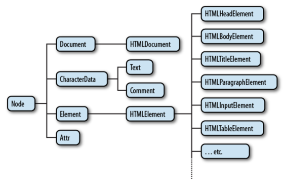

# 정리 필요글

### Gson -> Serialization 마이그레이션

- (가니쉬) 모듈화에서의 라이브러리 import

### LaunchedEffect
-

### Promise

### Corse

## 12/26

### Bom 분석
- Navigator (브라우저 정보 객체)
  - 브라우저 관한 정보 및 userAgent 값 접근 가능
- History (앞,뒤로 이동한 라우트 내역이 존재함)
- Location (현 URL 주소 데이터가 들어있음 )
  - Window.location.herf 를 통한 리다이렉션 구현가능
- Screen (사용자 화면 크기를 나타낼때 씀)

### ReactRouter 제공 훅 정리
- useNavigate: 페이지 이동 훅
- useParams: path parameter 정보를 반환함(동적 라우팅에서 유용)
- useSerachParams: 쿼리스트링 변수를 반환함
- useLocation: 경로 정보를 담고 있음
- useMatch: url path 이름에 대한 패턴일치 여부를 반환

[정리]<br/>
useParams 는 오직 path parms 만을 지원한다
useSearchParams 는 쿼리 파람을 지원한다

[참고]<br/>
- https://velog.io/@bomida/React-useNavigate-useParams-useLocation-useMatch
- https://velog.io/@rayong/%EB%A6%AC%EC%95%A1%ED%8A%B8-%EA%B8%B0%EC%B4%88-%EC%BF%BC%EB%A6%AC-%EC%8A%A4%ED%8A%B8%EB%A7%81-useSearchParams

---

## 12/19
[FE]

### TS 구조 분석

```
export const Field = <TFieldValues extends FieldValues = FieldValues,
TName extends FieldPath<TFieldValues> = FieldPath<TFieldValues>,
>({
...props
}: ControllerProps<TFieldValues, TName>) => {
return (
  <FieldContext.Provider value={{ name: props.name }}>
    <Controller {...props} />
  </FieldContext.Provider>
  )
}
```
- 변수형으로 선언된 함수형 컴포넌트이다. ( const x = () => {} )
- Props 에서 사용할 타입을 제네릭으로 정의했다. 
  - 이때 제네릭으로 주입 받을 수 있는 타입은 FieldValues 를 상속해야한다
  - 기본 제네릭 값으로 FieldValues 를 설정해, 사용자가 주입을 명시하지 않아도 된다
- 제네릭 변수는 두개를 받는다 (TFieldValues, TName)

---
## 12/18

[FE]

### CSS: Flex

- 컨테이너 적용 속성
    - "display: flex" :

## 12/14.png)

[Android]

- LazyColum key 누락 이슈
    - recyclerview 에서 스크롤시 이전 아이템의 데이터의 뷰 정보를 공유하는 이슈와 비슷한 현상 발생(ex-체크박스가 체크되어야하지 않아야할 곳에 체크되어짐)
    - diffUtils 를 구현했던 것과 같이 key 값을 넣어서 해결 가능
---
## 12/14
[FE]

### Flex 속성

- flex-grow
    - Flex 3번째 요소인 flex-basis 보다 늘어날 수 있는지 결정하는 속성
    - default 값은 0 -> inflexible 한 상태를 의미
    - 1이상의 값인 경우 화면 넓이에 따라 유동적 변화 -> flexible
- flex-shrink
    - flex-basis 보다 줄어들 수 있는지 결전하는 속성
    - 디폴터값은 1 이고 1이상의 속성일때 해당 비율로 줄어듬
    - 0일경우 inflexible
- flex-basis
    - flex item 의 기본크기
    - 디폴트 값인 auto 는 컨텐츠 너비를 의미
    - flex-direction 이 row 일때는 너비, column 일때는 높이를 의미
- flex: 1
    - flex-grow:1 , flex-shrink:1, flex-basis: 0%
    - 기본 점유크기를 0으로 만든후 화면 비율에 따라 유연하게 조절됨


- Component props 값을 넣어 줄때는 중괄호 안에 넣어준다
- 중 children 은 예외적으로 중괄호 대신 컴포넌트 태그 사이에 입력한다
- JS 스프레드 연산자
    - 리스트에 사용시 리스트 벗겨짐
    - 리스트 합치기 가능 [...a, ...b]
    - 리스트 DeepCopy에 사용가능 b = [...a]
    - object 를 합치거나 복사에도 사용가
    - 정의치 않은 prop 사용을 가능케함
        - ButtonInterface 로 prop 을 정의해두어 정의하지 못하지만 외부에서 전달되는 prop 을 내부에서 사용가능

```js
export default function Button({
  variant,
  size,
  styles,
  ...props
}: ButtonInterface) {
  return (
    <button
      {...props}
    >
    </button>
  )
}
```
---
## 12/6

- Dom 이란?
    - 브라우저에서 html 의 요소들 객체화하여 들고 있는 주체
    - DOM 은 트리 전체를 칭하고 이때 가장 상위에 있는 객체가 document 임
    - window.document 객체가 DOM 에 분류됨
    - HTML 엘리먼트들은 Node 를 상속 받기 때 문에 최종적으로 DOM 은 node 들을 들고 있는 형태
    - Dom 은 트리구조로 Html 요소들을 객체형태로 들고 있게됨
      

- CSSOM
    - 비슷한 형식으로 HTML 대신 CSS 가 대상인 DOM 이다
    - DOM(html) + CSSOM(css) 이 융합되 우리가 보는 화면 구성
- BOM
    - 브라우저 자체를 다루기 위한 API
    - window.location, .history, .navigator 등 / alert, setTimout 등등 이 있음
- 이와같이 DOM, BOM 이서 제공하는 함수들을 WEB API 라고 함
---
## 12/5

- TypeScript 에서 JS 외부 라이브러리를 사용하려면 타입 정보가 필요하고 그에 따라 타입 정보를 갖는 파일을 "타잊 정의 파일" 이라고한다
- 타입 정의 파일은 두가지 형태로 적용가능
    - 라이브러리에서 제공: @types/라이브러리 해당 모듈을 설치
        - node_modules 하위에 @types 안에 타입 정의 파일들이 모이는 곳에 담기게됨
    - 미제공: .d.ts 파일을 추가 -> 직접 제작
        - 해당 라이브러리와 같은 위치에 .d.ts 파일을 생성하여 type을 정의해주어야함
    - 참고: 실제 라이브러리 코드는 node_modules 안에 해당 라이브러리 이름으로 접근하여 확인 가능
---
## 12/04

### 해상도란

- 얼마나 많은 픽셀로 이루어져있는가를 의미함
- 같은 해상도(픽셀수) 이더라도 화면 크기에 따라 선명도가 달라지기때문에 PPI 밀도 단위를 사용함

### PPI

- pixel per inch 는 일인치당 픽셀의 개수
- 픽셀의 밀도를 나타냄
- PPI 가 높을수록 선명함

### 물리픽셀 / 논리픽셀,DPR

- 개발시에는 물리픽셀이 아닌 논리픽셀을 작업함
- 논리픽셀과 물리픽셀 비율은 device-pixel ratio
---
## 11/30

### Fragment Result API

- 화면간 데이터 전달에는 viewmodel 공유, nav graph safe args, Fragment ResultApi 등이 있다
- https://developer.android.com/guide/fragments/communicate
- ResultAPI 방식은 특정 데이터를 이전 화면에 돌려주고 싶을때 사용하기좋음
- PIN check, 보안 관련 등등 에서 유용함

### LaunchedEffect

- 코루틴 suspense 키워드
    - 코루틴의 코드에는 코루틴을 일시 중단 시킬 수 있는 함수 또는 코드가 포함될 수 있다
    - 이런 중단 코드 코루틴 내부에 포함되거나 suspend fun 으로 정의 되어야하만 한다
- 내일 이어서...
---
## 11/29

### 모듈화에서의 라이브러리 import

- 모듈간 의존성과 상관없이 라이브러리는 각 모듈에서 import 해야한다
- 기본적으로 implementation 을 사용했을 경우 모듈별로 import 됨
- 과거 compile 키워드는 deprecated 되었고 역할을 api 가 대체한다(둘 모두 권장X)
- implementation 대신 api 키워드를 통해 종속성을 라이브러리 import 에도 대입할 수 있지만 권장되지 않음
    - 모듈을 사용할때는 모듈의 인터페이스만이 외부에 노출되어야하는데 라이브러리의 인터페이스까지 노출되면 안되기 때문
---
## 2023/11/28

- 한 컴퓨터에서 github 계정을 여러개를 사용할때는 컴퓨터에서 ssh 를 만들어 계정에 등록하여 사용하면
  된다 [참고링크](https://velog.io/@skyepodium/Github-SSH-Key-%EB%93%B1%EB%A1%9D%ED%95%98%EA%B8%B0)


