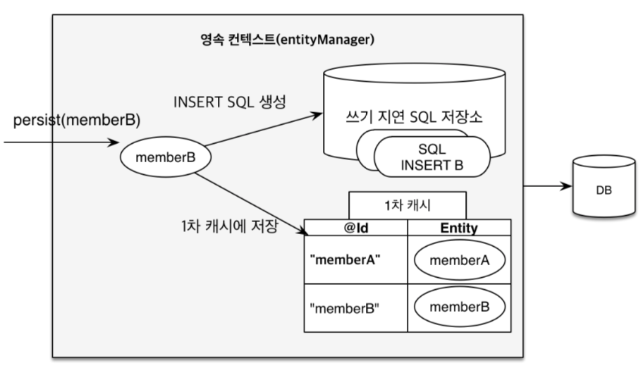

# 자바 ORM 표준 JPA 프로그래밍 책 참고

### 3/19

# 영속석 컨텍스트
- 엔티티 매니저를 사용해서 회원 엔티티를 영속성 컨텍스트에 저장한다
- 엔티티를 식별자 값을 구분하기때문에 반드시 식별자 값을 필요로 한다
  - 영속석 컨텍스트의 장점
    - 1차 캐시 + 동일성 보장
    - TX 안에서의 쓰기 지연
    - 변경 감지
    - 지연로딩

### 1차캐시 
- 식별자 값을 키로 갖는 식별자 값으로 갖는 캐시를 가진다
- 조회시에는 1차 캐시를 먼저 보고 후에 없을때 DB 를 조회
- 이를 통해 none repeatable read 를 막을 수 있음 -> 동일성 보장
### 쓰기 지연
- 엔티티 매니저는 tx를 커밋하기전까지 쿼리들을 저장해놓는다
- 실제 tx 는 명시적이든 내부적이든 flush 가 호출 되는 시점에 한번에 나간다.
- @Transaction 이 있더라도 실제 DB 에서 동작하는 TX 시점과 동일하지 않을 수 있다.
- 참고) 이에 따라 삭제의 경우 commit 전에 조회하면 여전히 조회 가능

### 변경감지
- Entity update 상황에서는 1차 캐시에서 가지고 있는 스냅샷과 비교하여 값이 바뀜
- 그러나 JPA 의 기본 전략은 엔티티의 모든 필드를 업데이트한다
  - 수정 쿼리가 항상 같은 이점이 있다
  - db 에서도 한번 파싱된 쿼리를 재사용할 수 있다
  - 컬럼 30개 정도쯤되면 수동 sql 을 통한 업데이트가 효과적일 수 있다

### 플러시
- 직접호출, tx commmit, JPQL 쿼리 실행시 호출된다
- JPQL 은 1차 캐시 데이터를 참조지 않고 바로 DB 에 꽂기 때문에 일관성 유지를 위해 내부적으로 flush 함
